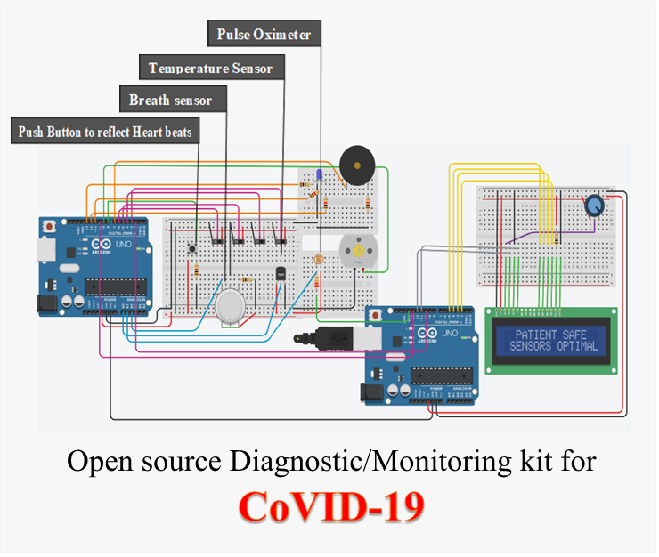

# Open source Monitoring kit for CoVID-19 on TinkerCad

Design an open-source diagnostic/monitoring array by integrating multiple biosensor units,thereby aiming towards a Point-of-care diagnostic toolkit for Covid-19.

## Dependencies

* [Autodesk TinkerCad](https://www.tinkercad.com/) - TinkerCad
* [LCD](https://github.com/arduino-libraries/LiquidCrystal) - LiquidCrystal.h


## Getting Started

Default Arduino sketch template looks like:
```
void setup() {
  // put your setup code here, to run once:
 
}
 
void loop() {
  // put your main code here, to run repeatedly:
 
}
```
This example code for Liquid Crystal library.
```
// include the library code:
#include <LiquidCrystal.h>

// initialize the library by associating any needed LCD interface pin
LiquidCrystal lcd(12, 11, 5, 4, 3, 2);

void setup() {

  // set up the LCD's number of columns and rows:
  lcd.begin(16, 2);
  
  // Print a message to the LCD.
  lcd.print("hello, world!");
}

void loop() {

  // set the cursor to column 0, line 1
  lcd.setCursor(0, 1);
}

```

## Features 
*	In these unprecedented times, where it is very hard to keep a track of all those infected by this virus, an even bigger problem is to manage so many patients into the hospitals. Hospital beds are lacking for those in actual need of a ventilator. Although this is just a basic idea, it has been designed keeping in mind that multiple patients tested positive for Covid 19 can be self-quarantined in their home or a separately isolated place while this device can help the user/patient to self-monitor the parameters and an emergency signal is reported to the hospital in case required.
In this way, only those in need of specialised care will be admitted to the hospitals. 

* It can also be used as a diagnostic device to check various physiological parameters making it an easy, compact and time-saving process. Thereby, it can be used at places like Airports, schools & colleges, companies and everywhere else where a detection checkpoint is needed.
* A separate alarming circuit is provided that informs the patient as well as informs (calls emergency number) the nearby hospital immediately. (Can be done via a Wifi module or IOT setups)
* As all the sensors are managed by their individual slide switches, it is easy to operate
* A multi RGB led is used to serve multiple purposes.
* A 16*2 wide LCD screen makes it easier for the patient to visualise the process parameters.
* Apart from the LCD screen, a separate serial monitor provides the continuous values from the sensor for the managing authority to check later.

## Circuit Diagram



## Contributing

Please read Instructions for the process for submitting pull requests to us.

## Reference

* https://www.cdc.gov/coronavirus/2019-ncov/hcp/disposition-hospitalized-patients.html#definitions
* https://www.elprocus.com/phototransistor-basics-circuit-diagram-advantages-applications/
* https://www.mdpi.com/1424-8220/17/3/565/htm


